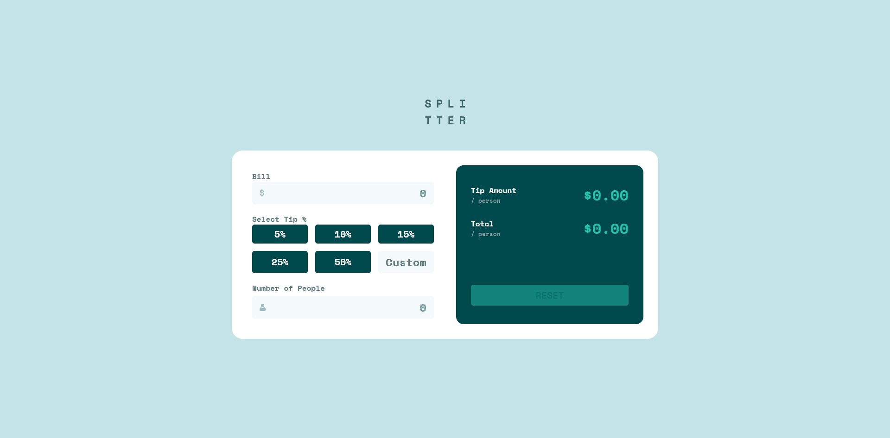

# Frontend Mentor - Tip Calculator App Solution

This is a solution to the [Tip Calculator App challenge on Frontend Mentor](https://www.frontendmentor.io/challenges/tip-calculator-app-ugJNGbJUX). Frontend Mentor challenges help you improve your coding skills by building realistic projects.

## Table of contents

- [Overview](#overview)
  - [The challenge](#the-challenge)
  - [Screenshot](#screenshot)
  - [Links](#links)
- [My process](#my-process)
  - [Built with](#built-with)
  - [What I learned](#what-i-learned)
- [Author](#author)

## Overview

### The Challenge

Users should be able to:

  - View the optimal layout for the app depending on their device's screen size

  - See hover, active, and focus states for all interactive elements on the page

  - Calculate the correct amount of tip and total per person

  - Display an error message when the number of people input is zero

  - Reset the calculator to its initial state once active inputs are clear

### Screenshot



### Links

- [Solution](https://github.com/Kking927/tip-calculator-app)
- [Live Site](https://kking927.github.io/tip-calculator-app/)

## My process

### Built with

- Semantic HTML5 markup

- CSS custom properties & BEM methodology

- Mobile-first workflow

- Flexbox & CSS Grid

- Vanilla JavaScript

### What I learned

This project was a good opportunity to deepen my understanding of vanilla JavaScript logic and modern CSS features.

1. **Advanced Dynamic Styling with CSS `color-mix()`**

    Instead of hardcoding dedicated values for hover states, I used the modern CSS `color-mix()` function to generate fluid interaction states programmatically.
    
    ```css
    /* Dynamic hover state using color-mix */
    .calculator__tip-btn:hover,
    .calculator__reset-btn:hover:not(:disabled) {
      color: var(--green-900);
      background-color: color-mix(in srgb, var(--green-400), var(--grey-200));
    }
    ```

2. **Mastering Interactive UI States**

    I improved my ability to implement subtle micro-interactions across the entire user interface. I worked on ensuring focus ring indicators (`:focus-visible`), hover elevation (`:hover`), and tactile click feedback (`:active`) were applied correctly.
    
    ```css
    /* Tactile click feedback for interactive elements */
    .calculator__tip-btn:active,
    .calculator__reset-btn:active {
      transform: scale(0.97);
    }
    ```

3. **Structured JavaScript Logic & Event Handling**

    Building the JavaScript helped me improve my ability to step back, plan the logic flow before writing code, and consider how a user would interact with the calculator:
    
   * **Decoupled Calculations:** Separating `calculateTip()` and `updateResetButtonState()` into single-responsibility functions made state updates predictable.
    
   * **Input Synchronization:** Managing custom inputs alongside preset button active states required explicit cleanup (`classList.remove('calculator__tip-btn--active')`) whenever a custom percentage was entered.
    
   * **Form Submission Handling:** Overriding the default form submission prevented accidental page reloads on keyboard entry (`Enter`).

## Author

  - Frontend Mentor - [Kking927](https://www.frontendmentor.io/profile/Kking927)

  - GitHub - [@Kking927](https://github.com/Kking927)
